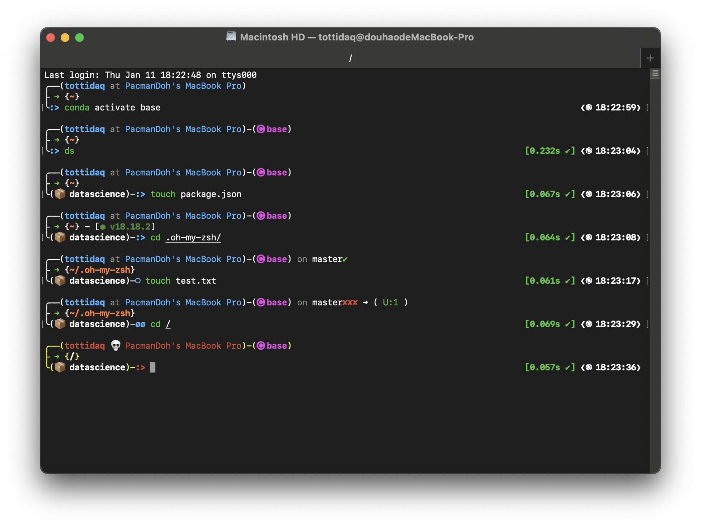

Inspired by kali-zsh-terminal :heart:

<samp><b>Oh-My-ZSH theme for PacmanDoh's Mac Terminal</b></samp>

## Preview 👀

multiline:

oneline:

## Install 🔧

You have the option to use the install.sh script, which installs [Oh-My-Zsh](https://github.com/ohmyzsh/ohmyzsh), the pacmandoh-theme, and three commonly used plugins ([`zsh-autosuggestions`](https://github.com/zsh-users/zsh-autosuggestions), [`zsh-syntax-highlighting`](https://github.com/zsh-users/zsh-syntax-highlighting), [`conda-zsh-completion`](https://github.com/conda-incubator/conda-zsh-completion)). The script includes various solutions, such as accelerated downloads for users in China and automatic injection of configurations into the `.zshrc` file.

Alternatively, you can manually copy the theme files to `~/.oh-my-zsh/custom/themes/`. The choice is yours based on your preferences.

## Feature 🚀

- Adapt to Linux or macOS
- Git info
- Color changes based on permissions
- Python environment (conda, virtualenv)
- Displaying the environment identified based on files in the working directory (Node - "package.json")
- One-stop installation script
- Selectable style
  - multiline or oneline
  - timer
  - new line before prompt

**Note**: In Linux, the determination is based on whether the user is the root. On macOS, the logic is determined by whether the user is the owner of the folder.

## Configuration ⚙️
You can easily customize your setup using the installation script or by modifying the ~/.zsh file. Below are the available configuration options:

1. **Prompt Style:**
  - `PACMANDOH_PROMPT_ALTERNATIVE`: Choose between `multiline` or `oneline` style. 
    - default: `multiline`

2. **Timer Requirement:**
  - `PACMANDOH_NEED_TIMER`: Set to `yes` if a timer is required.
    - default: `yes`

3. **Newline Before Prompt:**
  - `PACMANDOH_NEWLINE_BEFORE_PROMPT`: Set to `yes` if a newline is desired before the prompt.
    - default: `yes`

**Note**: When in `oneline` mode, the default values for the other options are set to `no`

## Supplement 📃

This omz-theme is listed in [`awesome-zsh-plugins`](https://github.com/unixorn/awesome-zsh-plugins) :heart:, where you can find more comprehensive information for your reference

## LICENSE

[MIT](./LICENSE)
